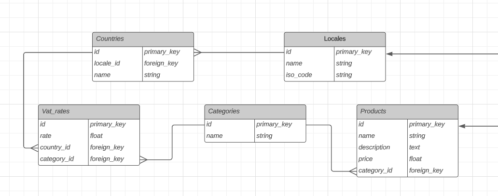

1. `docker-compose -f docker-compose.prod.yml up --build -d`
2. `docker exec lambda_test_task_app_1 php bin/console doctrine:migration:migrate --no-interaction`
3. `docker exec lambda_test_task_app_1 php bin/console doctrine:fixtures:load --no-interaction --append`

You can find api docs here:
http://localhost:8000/api/

To get product final price:

Request to:  `/api/product_price/{id}/{iso_code}`

Example: `/api/product_price/1/UA`

Database structure:

